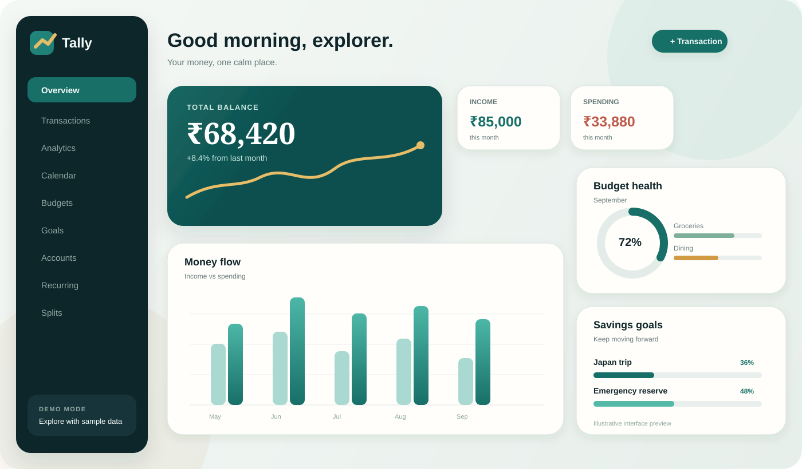

<div align="center">

# Tally

### Personal finance, without the spreadsheet headache.

A modern personal finance app for tracking money, planning spending, and understanding where it goes.

[](https://www.chandanpanda.in/)
[](https://react.dev/)
[](https://www.typescriptlang.org/)
[](https://supabase.com/)
[](https://developer.mozilla.org/en-US/docs/Web/Progressive_web_apps)

<p>
  <a href="https://www.chandanpanda.in/">Live App</a> •
  <a href="https://github.com/Chandan-panda/Tally-PROD">Source Code</a>
</p>

</div>

---

## ✨ The idea

Most personal finance apps either feel too basic or too much like accounting software. **Tally sits in the middle**: a calm, visual workspace that helps you capture everyday money activity and turn it into useful financial context.

You can track income and expenses, manage multiple accounts, set budgets and savings goals, monitor recurring money, split expenses, and explore analytics — all in one place.

### Try it without signing up

Open the app and choose **Explore with sample data**. The demo is client-side and read-only, so you can explore the product without creating an account or touching production financial data.

<div align="center">

[**→ Open Tally**](https://www.chandanpanda.in/)

</div>

---

## 📸 Product preview

<div align="center">



</div>

> **Note:** The image above is an illustrative product preview. The live application at [chandanpanda.in](https://www.chandanpanda.in/) is the source of truth for the current UI.

---

## 🚀 What you can do with Tally

| | Feature | What it gives you |
|---|---|---|
| 💸 | **Money tracking** | Income, expenses, transfers, categories, tags and notes |
| 🏦 | **Accounts** | Bank, credit card, UPI/wallet, cash, investments and loans |
| 🎯 | **Budgets & goals** | Monthly budgets, savings targets, deadlines and progress |
| 🔁 | **Recurring money** | Scheduled income/expenses with automatic or reminder-only rules |
| 📊 | **Analytics** | Trends, category breakdowns, comparisons, savings rate and net worth |
| 🗓️ | **Calendar** | Daily spending activity and transaction drill-down |
| 🤝 | **Splits** | Track shared expenses and settlement status |
| 🔎 | **Search & filters** | Find transactions by text, type, category, account, date or amount |
| 📦 | **Import / export** | CSV + JSON export and CSV import with automatic missing-category/account creation |
| 🎨 | **Customization** | Categories, colors, currency, profile settings and light/dark/system themes |
| 📱 | **PWA** | Installable app experience across supported devices |

---

## 🔐 Built with privacy in mind

Authenticated data is stored in Supabase/PostgreSQL and protected with **Row Level Security**, keeping each user's records isolated.

The guest experience follows a separate local-data path: demo records stay in the browser and are never inserted into Supabase. Mutation actions are gated behind authentication. This keeps the demo useful without mixing sample data with real user data.

---

## 🧠 A few things happening under the hood

```text
React + TypeScript
        │
        ├── React Router ─────── Application routes
        ├── TanStack Query ───── Server state & caching
        ├── Zustand ──────────── UI state
        └── Tailwind CSS ─────── Design system
                 │
                 ▼
             Supabase
        ┌────────┴────────┐
        │                 │
      Auth             PostgreSQL
        │                 │
        └────── RLS ──────┘

Guest Mode ──► Local demo dataset ──► No Supabase writes
```

The codebase keeps data access concentrated in the API layer, domain utilities under `src/lib`, reusable UI in `src/components`, and route-level experiences in `src/pages`.

---

## 🛠️ Tech stack

**Frontend:** React 18 · TypeScript · Vite · Tailwind CSS · React Router · Recharts  
**State:** TanStack Query · Zustand  
**Backend:** Supabase · PostgreSQL · Auth · Row Level Security  
**Utilities:** date-fns · PWA via `vite-plugin-pwa`

---

## ⚡ Run locally

### 1. Clone

```bash
git clone https://github.com/Chandan-panda/Tally-PROD.git
cd Tally-PROD
```

### 2. Install

```bash
npm install
```

### 3. Configure Supabase

Create a Supabase project and add a `.env` file:

```env
VITE_SUPABASE_URL=your_supabase_url
VITE_SUPABASE_ANON_KEY=your_supabase_anon_key
```

Run the database migration from:

```text
supabase/migrations/0001_init.sql
```

### 4. Start

```bash
npm run dev
```

For a production build:

```bash
npm run build
npm run preview
```

---

## 🗺️ Roadmap

Tally is still evolving. Planned improvements include better PWA icons, budget rollover, receipt attachments, offline writes, multi-currency accounts, recurring reminders, generated Supabase types, and automated tests.

---

## 👋 About

Tally is a personal project built by **Chandan Panda** to make personal finance management simpler, clearer, and more enjoyable to use.

<div align="center">

### Keep count of what counts.

[**Try Tally →**](https://www.chandanpanda.in/)

</div>
